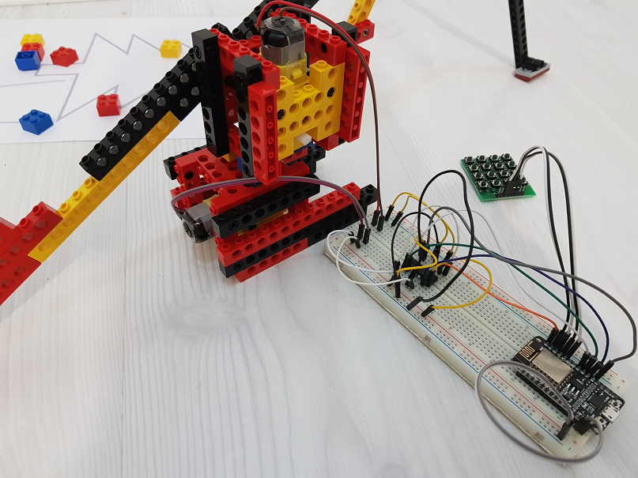

# Robotic arm with DC motors and lego casing

## Description

This was a proof of concept, that it is possible to create robotic arm with only 2 motors, so it able to do some tasks. Prior to that there were a failed attempt to make it with a single motor.

Component costs:
 - lego parts: 4 €
 - breadboard: 1 €
 - nodemcu: 3 €
 - motors: 2 €
 - driver: 0.5 €
 - button pad: 0.5 €
 - wires: 0.5 €
 
 Total: ~12 €
 
 

## Video

Robotic arm in action!

<iframe width="620" height="315" src="http://www.youtube.com/embed/PBpALjJ6y2A" frameborder="0" allowfullscreen></iframe>

## More images

Image with all the electronics except powerbank. 

Cube sizes (cm):

## Credits

created by Konstantin Petrukhnov

## Sponsor links

