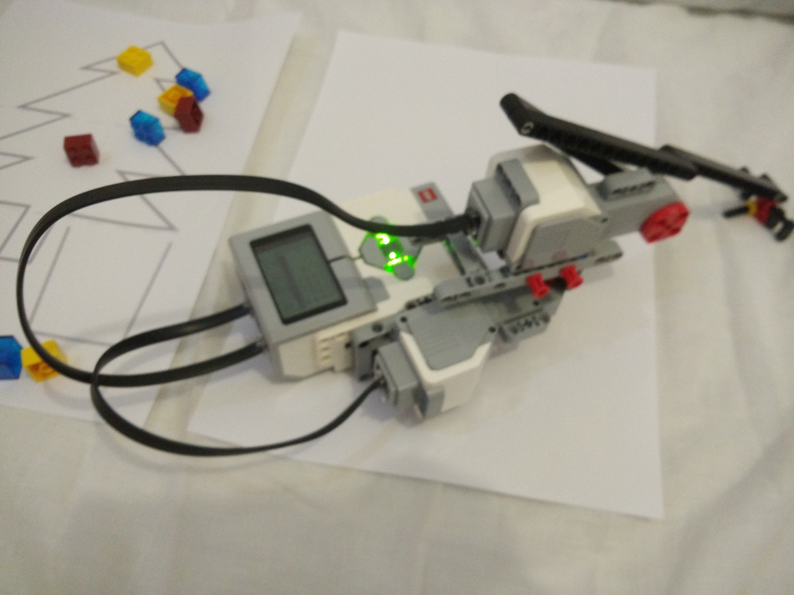
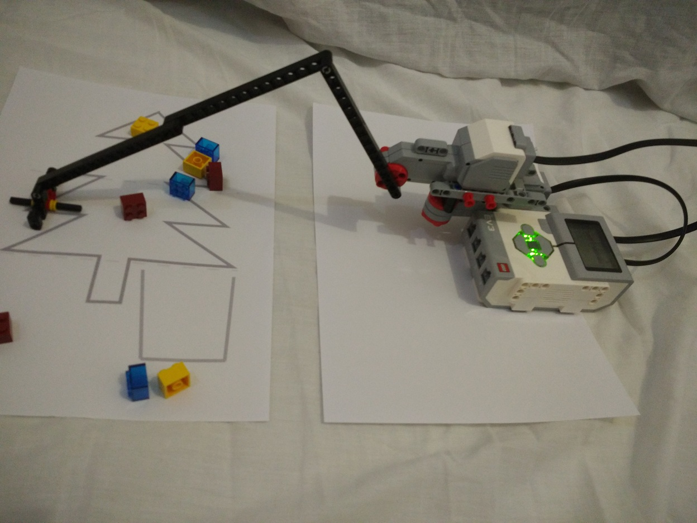
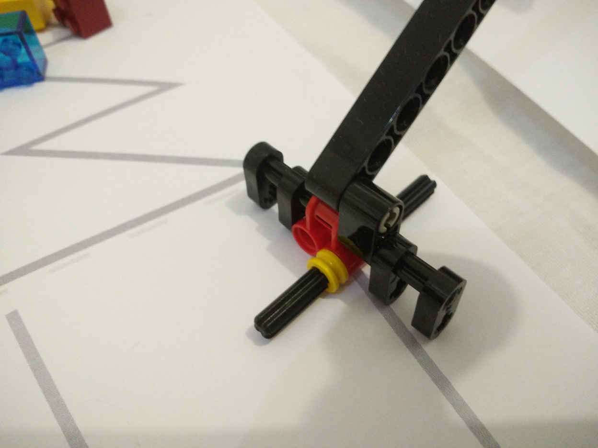
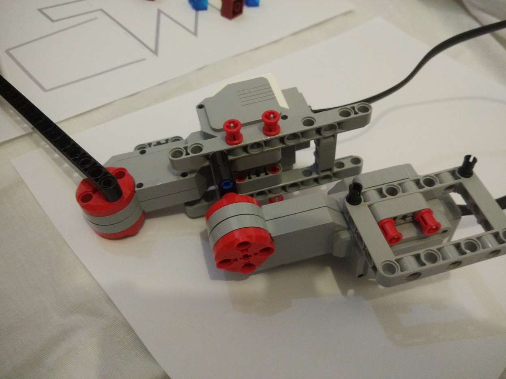

# Robotic arm with Lego EV3

(email submission)

## Description

Made with Lego ev3.Controlled by mobile app from another phone.

## Video

  <iframe
      src="vid1.mp4"
      width="700"
      height="480"
      frameborder="0"
      allowfullscreen="">
  </iframe>

## Images

## Credits

created by: Vlad (p...g@y....ru)

