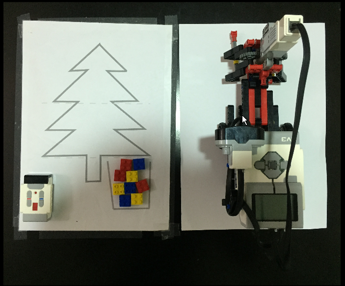
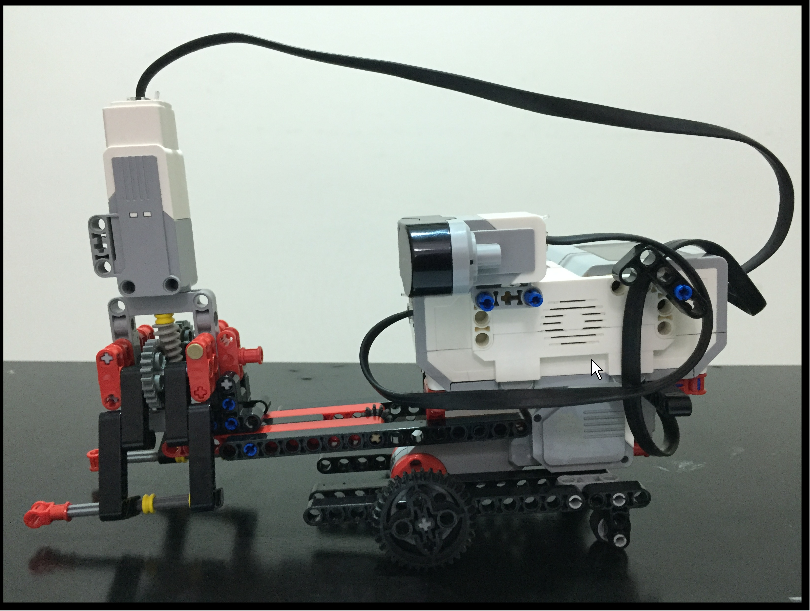
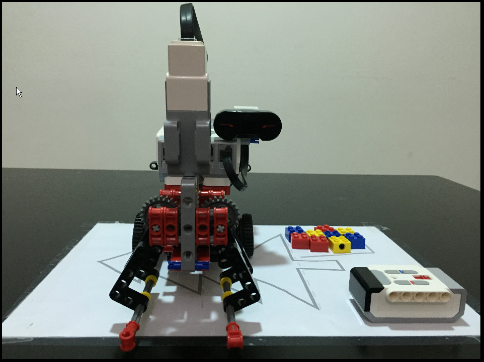
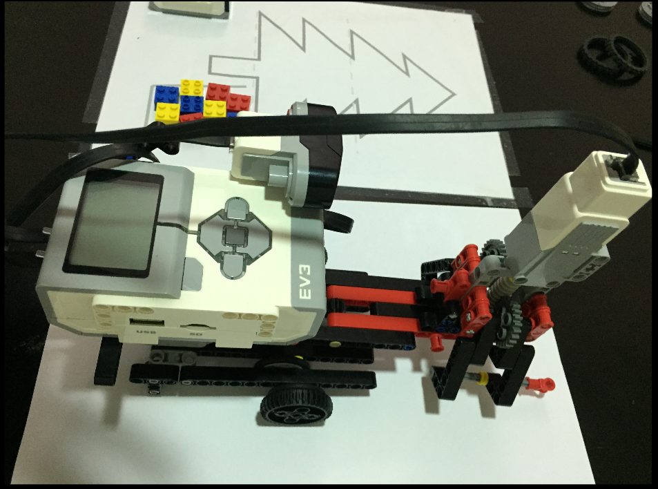
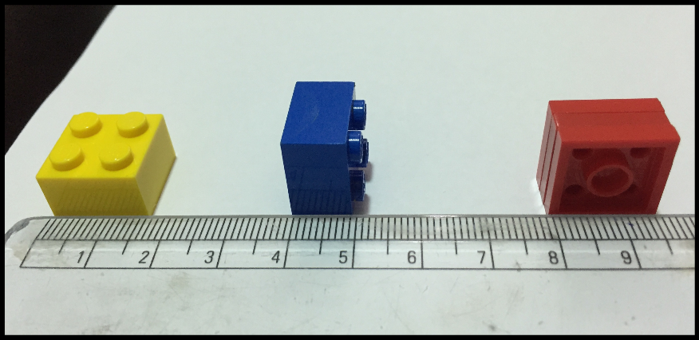

# Two motor robot

(email submission)

## Description

Two motor robot
 
This robot is made out of Lego Mindstorm EV3. It uses one free wheel, two normal 
wheels, one large motor, one medium motor and an infrared sensor for controlling 
the robot. The wheels are connected to the a large motor. When the motor rotates 
forward the wheels move normally, but when the motor moves backward, the free 
wheel creates an imbalance which cause it to turn. The claw works like any other 
normal claw. The medium motor turns two gears which in turn moves the two 
fingers of the claw. The controlling of the robot is done using remote control. 

## Video

<iframe width="620" height="315" src="http://www.youtube.com/embed/7hP5KUrxZko" frameborder="0" allowfullscreen></iframe>

## Images

## Credits

created by: 

Eega Siddharth Reddy  (e...y@g....com)

GEMS New Millennium School (Grade 5C) 

