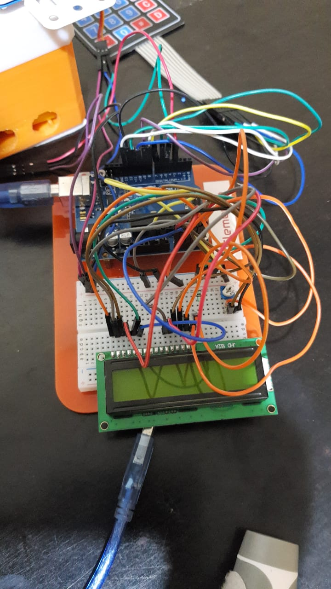

# Cardboard arm

(email submission, 2018-12-30)

## Description

Robotic Arm created using 2 servo motors and mechanics parts, servo motors are controlled with keypad using arduino uno.

https://hackaday.io/project/163041-robotic-arm-using-2-servo-motors

## Video

  <iframe
      src="vid1.mp4"
      width="700"
      height="480"
      frameborder="0"
      allowfullscreen="">
  </iframe>

## Images

## Credits

Authors: Aahaan Ved

a...d@g...com

